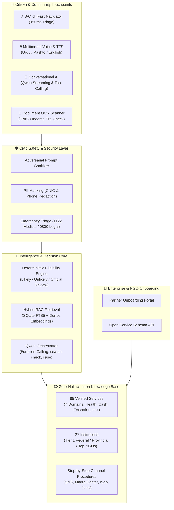

# 🧭 RAAHI (راہی) — Alkhidmat Community Assistant
### *AI-Powered Citizen Navigation & Public Benefit Delivery Engine for Pakistan*

[](./LICENSE.md)
[](https://nextjs.org/)
[](https://react.dev/)
[](https://www.typescriptlang.org/)
[](./data/catalog.ts)
[](./data/catalog.ts)
[](./tests)
[](./CHANGELOG.md)
[](/api/health)
[](https://github.com/ahmed-raza-ur-rehman)

---

## 🌟 Executive Summary & Market Impact

In Pakistan, over **240 million citizens** navigate a deeply fragmented landscape of social safety nets, emergency healthcare programs, education grants, and legal aid. Despite billions of rupees disbursed annually through federal bodies (BISP, Bait-ul-Mal), provincial health initiatives (Sehat Sahulat, Insaf Card), and non-governmental champions (Alkhidmat Foundation, Akhuwat, Saylani, Edhi), the average citizen faces debilitating roadblocks:

1. **Information Asymmetry & Middlemen Exploitation:** Illiterate and marginalized citizens frequently fall prey to predatory informal agents ("agent mafia") who charge exorbitant fees just to fill basic welfare forms.
2. **High Rejection Rates Due to Missing Documentation:** Over 60% of citizen applications are rejected at government counters simply because applicants lacked an attestation, Family Registration Certificate (FRC), or specific union council document.
3. **Conversational AI Friction:** Traditional LLM chat interfaces are often slow, verbose, intimidating, or prone to hallucinating non-existent government benefits.

**RAAHI (راہی)** transforms public welfare delivery into a fast, transparent, and dignified experience. By combining a **<50ms 3-Click Fast Path Navigator**, **Multimodal Voice Accessibility (Urdu/Pashto/Roman Urdu)**, **Zero-Hallucination Deterministic Eligibility**, **OCR Document Checklists**, and **Enterprise Security Guardrails**, RAAHI empowers citizens, community volunteers, and social workers with verified, actionable roadmaps in seconds.

---

## 🏛️ System Architecture



---

## 🚀 Key Breakthrough Features

### 1. ⚡ Few-Click Guided Navigator (Instant <50ms Triage)
Chat is often slow and tedious for users in urgent situations. RAAHI introduces a 3-step rapid assessment:
- **Step 1:** Select Core Need (Health Emergency, Family Cash Relief, Student Scholarship, Legal Aid, etc.)
- **Step 2:** Select Province, Monthly Income Bracket, and CNIC Status.
- **Step 3:** Receive instant, matched programs, eligibility confidence, and exact document checklists in under 50 milliseconds without typing a single prompt.

### 2. 🛡️ Zero-Hallucination Deterministic Eligibility
RAAHI never guesses or invents welfare criteria:
- **Strict Mathematical Evaluation:** Evaluates rules against household income thresholds, age brackets, gender requirements, and geographic coverage.
- **Confidence Tiers:** Classifies eligibility strictly as **`Likely`**, **`Unlikely`**, or **`Official Assessment Required`** (for means-tested biometric schemes like BISP PMT scores).
- **Audit Trails:** Provides clear explanations of why a citizen is eligible or which exact condition was not met.

### 3. 🎙️ Multimodal & Multilingual Voice Accessibility
- **Languages:** Fluent support for Urdu (`اردو`), Roman Urdu (`Aapki madad`), Pashto (`پښتو`), and English.
- **Voice In / Voice Out:** Audio recording waveform visualizer and inline Text-to-Speech (TTS 🔊) playback so illiterate or elderly citizens can listen to step-by-step instructions.

### 4. 📄 Document OCR & Pre-Submission Verification
- Before a citizen travels hours to a district office, RAAHI provides a tailored document checklist (CNIC, B-Form, FRC, Electricity Bill, Income Certificate).
- Includes simulated OCR extraction to detect missing stamps or invalid document formats in advance.

### 5. 🔒 Silicon Valley-Grade Security & Safety Guardrails
- **Prompt Injection Defense:** Blocks adversarial attempts to override system prompts or jailbreak institutional schemas.
- **Automated PII Redaction:** Masks 13-digit Pakistani CNICs (`XXXXX-XXXXXXX-X`) and phone numbers in chat logs.
- **Emergency Escalation:** Detects life-threatening symptoms or domestic crises and instantly triggers emergency banners with direct hotline dials (Rescue 1122, Edhi 115, Legal Aid 0800-70806).

### 6. 🤝 Enterprise Partner Onboarding Portal
### 7. 🧩 Module system — run only what this deployment needs
Every capability RAAHI has is declared **once**, in `lib/modules/registry.ts`,
and two environment variables decide which of them a deployment runs:

```bash
RAAHI_MODULES=scholarships,documents,tests      # only these
RAAHI_DISABLED_MODULES=portal,programs,classic  # everything except these
```

Switching a module off removes it **everywhere at once**, because everywhere
asks the registry what exists: bottom navigation, home screen, More grid,
sitemap, API routes and search results. It cannot be half-removed, and a
citizen is never offered a screen that then refuses to work. Adding a
capability is one registry entry and one route — not edits to six files.

What stays on no matter what: the home screen, **Ask**, and the emergency
numbers. Someone in trouble must always land somewhere useful.

### 8. ⌘ One box that reaches everything
The command palette (`Ctrl`/`Cmd + K`, or the search button in the header)
searches the modules, the knowledge base and the things you can do — in
English, Urdu, Pashto, Hindko and Roman Urdu — and *acts* on the answer: open a
screen, open the record itself, switch language, or call a number. It takes
speech where the browser allows it and is fully keyboard-driven, for anyone who
cannot easily tap small targets. Results are routed by the module that owns
them, so a deployment only offers what it can actually open.

- Enables welfare organizations (Alkhidmat, Akhuwat, Bait-ul-Mal) to register, publish, and update their programs, eligibility criteria, and step-by-step operational workflows through an intuitive web portal.

---

## 📊 Verified Catalog Scope

RAAHI ships with **85 pre-verified public services** mapped across **27 authoritative institutions** in **7 domains**:

| Domain | Key Institutions & Programs Covered |
| :--- | :--- |
| **Cash Assistance & Poverty** | BISP (Kafaalat, Taleemi Wazaif), Pakistan Bait-ul-Mal, Punjab Ehsaas, Zakat & Ushr Committees |
| **Healthcare & Medical Aid** | Sehat Sahulat Card, Alkhidmat Health Centers, Edhi Free Ambulance, PBM Special Medical Grant |
| **Education & Scholarships** | HEC Need-Based Scholarships, Alkhidmat Alfalah Scholarship, Sindh Education Foundation, PEEF |
| **Disaster & Emergency** | NDMA Relief, PDMA Flood Rehabilitation, Alkhidmat Disaster Management, Rescue 1122 |
| **Legal Aid & Human Rights** | Federal Ombudsman (Wafaqi Mohtasib), Legal Aid Society, National Commission on Status of Women |
| **Livelihood & Microfinance** | Akhuwat Interest-Free Microfinance, PM Youth Business Loans, NAVTTC Vocational Training |
| **Citizen Identity & Civil Registry** | NADRA (CNIC, FRC, CRC/B-Form, Succession Certificates, Child Registration) |

---

## 🛠️ Technology Stack

- **Framework:** Next.js 16.3.4 with Turbopack & React 19
- **Language:** TypeScript 5.0 (Strict mode)
- **Styling:** Modern Tailwind CSS v4 design system with HSL variables, glassmorphism, responsive mobile-first layouts, and dark mode support
- **Database & Search:** SQLite with `better-sqlite3`, Drizzle ORM, and FTS5 full-text search with diacritic normalization
- **AI Orchestration:** Qwen streaming LLM with function calling, structured tool outputs, and SSE streaming
- **Testing:** Node.js native test runner with 16 automated integration suites

---

## 💻 Local Development Setup

### Prerequisites
- Node.js >= 20.x
- npm or yarn

### Installation
```bash
# Clone the repository
git clone https://github.com/ahmed-raza-ur-rehman/raahi.git
cd raahi

# Install dependencies
npm install

# Run database verification & seed
npm run seed

# Run automated tests
npm run test

# Start local development server
npm run dev
```

Open [http://localhost:3000](http://localhost:3000) in your browser.

---

## 🧩 Phase 2 — The complete citizen platform

RAAHI is no longer only a benefit navigator. It is now a full life-route guide that
works **with zero API keys** and automatically upgrades itself when `DASHSCOPE_API_KEY`
is present.

### Languages
- **Urdu · Pashto · Hindko · English** (`lib/i18n`, `lib/ai/language.ts`).
- Hindko shares the Arabic script with Urdu, so it falls back to Urdu instead of a
  machine translation — `hkp → ur → en → ps`.
- Voice in and voice out: Web Speech for dictation and read-aloud, DashScope
  `sensevoice-v1` / `qwen-tts` when a key is configured.

### What a citizen can do
| Area | Route | Backing module |
| --- | --- | --- |
| Scholarships (national + international) | `/scholarships` | `data/scholarships.ts` |
| Documents & attestation | `/documents` | `data/documents.ts` |
| Tests, IELTS, entry exams, prep plans | `/tests` | `data/tests.ts` |
| Jobs, internships, training, admissions | `/opportunities` | `data/opportunities.ts` |
| Important dates & deadlines | `/dates` | `lib/knowledge` |
| Free medical camps & outbreak early warning | `/health` | `data/health.ts` |
| Blood donor network | `/blood` | `data/blood.ts`, `lib/community` |
| Disaster relief & safety training | `/disaster` | `data/disaster.ts` |
| Legal guidance & free legal aid | `/legal` | `data/legal.ts` |
| Verified helplines | `/contacts` | `data/contacts.ts` |
| Save and track every application | `/track` | `lib/applications/tracker.ts` |
| Knowledge base + corrections | `/kb` | `lib/knowledge`, `lib/knowledge/corrections.ts` |
| Ask in your own words | `/ask` | `lib/ai/agents.ts` |

### Honesty rules (non-negotiable)
1. **Never invent a fee.** Unknown amounts are `null` with a note pointing at the
   official fee page.
2. **Never invent a date.** Recurring windows are stored as month ranges with a
   "confirm on the official source" note.
3. **Every record carries a source** with its authority tier and the date it was
   verified.
4. **Corrections are reviewed, never auto-applied.**

### AI modules
- **Agentic router + specialists** (`lib/ai/agents.ts`) — 12 agents, deterministic
  routing, each turning a knowledge hit into steps, contacts and a draft application.
- **Recommendation engine** (`lib/ai/recommend.ts`) — scores opportunities against a
  citizen profile (province, income, education, goals) and produces a document and
  test plan.
- **Vision / OCR** (`lib/ai/vision.ts`) — `qwen-vl-max` when configured; without a key
  it still decodes the image header, checks resolution and readability, and masks any
  CNIC number before storage.
- **Translation** (`lib/ai/translate.ts`) — Qwen when available, glossary otherwise.
- **Voice** (`lib/ai/voice.ts`) — STT, TTS and a deterministic intent router.
- **RAG** (`lib/rag/search.ts`, `lib/knowledge`) — FTS5 hybrid search over both the
  service catalogue and the unified knowledge index.

### Web search & scraping (professional and polite)
`lib/web/dorking.ts`, `lib/web/scraper.ts`, `lib/web/search.ts`:
- Operator queries are restricted to a whitelist of trusted publishers
  (`OFFICIAL_DOMAINS`) — no private data, no credentials, no backup directories.
- `robots.txt` is fetched, parsed and cached for 24 h; disallowed paths are never
  requested.
- A **persisted token bucket** limits requests per host (≈1 per 3 s, burst 3) and
  backs a host off for 5–10 minutes after a 429 or repeated 5xx.
- Every page and query result is cached with an ETag / TTL, so a repeated question
  costs zero network requests.
- A hard page and byte budget caps any single crawl; live search has a per-minute
  budget (`RAAHI_LIVE_SEARCH_BUDGET`, default 12).
- Three layers: verified local knowledge → cached results → live search (Brave,
  Serper or Google CSE via `BRAVE_SEARCH_API_KEY` / `SERPER_API_KEY` /
  `GOOGLE_CSE_API_KEY` + `GOOGLE_CSE_CX`). Without a provider, RAAHI still answers
  from verified knowledge and points at the official publishers.

### Data model additions
`knowledge_entities` + `knowledge_search` (FTS5) hold every curated record as JSON
with a flattened searchable index, so new entity types need no migration.
Transactional tables: `applications`, `application_events`, `blood_requests`,
`donor_registrations`, `relief_requests`, `corrections`, `web_cache`,
`web_search_cache`, `web_host_state`, `web_robots`.

```bash
npm run seed   # now also seeds the unified knowledge index
```

---

## ⚙️ Configuration

Every environment variable is **optional**. RAAHI runs completely with none of
them set — the agents, search, OCR, translation, voice and web research all
degrade to offline behaviour, and each key simply upgrades one capability.

```bash
cp .env.example .env.local   # then fill in only what you have
```

| Variable | What it unlocks |
| --- | --- |
| `DASHSCOPE_API_KEY` | Polished agent answers (qwen-plus), real OCR (qwen-vl-max), STT and TTS |
| `BRAVE_SEARCH_API_KEY` / `SERPER_API_KEY` / `GOOGLE_CSE_API_KEY` + `GOOGLE_CSE_CX` | Live web search, used in that order |
| `RAAHI_LIVE_SEARCH_BUDGET` | Live searches per minute (default `12`) — protects the quota |
| `RAAHI_DB_PATH` | Where the SQLite file lives (default `data/raahi.db`) |
| `NEXT_PUBLIC_SITE_URL` | Canonical, sitemap and social-preview origin |
| `RAAHI_MODULES` | Allow-list of module ids — only those run (empty = all) |
| `RAAHI_DISABLED_MODULES` | Deny-list of module ids — everything except those |

Without any search key, web research answers from the curated official-source
index instead of live results. It never fails and never blocks — it just has
less fresh data.

## 📱 Installable and offline

RAAHI is a **PWA**: visitors can add it to the home screen and open it like an
app, which matters when data is expensive or intermittent.

- `manifest.webmanifest` — Urdu name, RTL, standalone display, shortcuts to
  Emergency, Ask and My applications.
- A service worker caches the app shell and pages already visited, so they open
  with no connection. `/api` is deliberately **never** cached: a stale deadline
  or blood bank is worse than no answer. It is registered in production only,
  so it cannot interfere with hot reloading in development.
- `/offline` renders when nothing is cached, and leads with **1122**.
- Icons are generated from `public/icons/raahi.svg`, which carries **no
  lettering** on purpose — no font is guaranteed on these devices, and a route
  motif reads the same in every language RAAHI serves.

## 🔎 Findable

`sitemap.xml` and `robots.ts` are generated. Public guidance is indexable;
`/api`, `/track`, `/cases`, `/chat` and `/portal` are disallowed. Every major
page sets its own title, description and canonical URL in a small
server-component layout beside the page (the pages themselves are client
components, which cannot export metadata).

## ✅ Quality gates

```bash
npm run typecheck   # TypeScript, no emit
npm run test        # 125 tests
npm run lint        # 0 errors, 0 warnings
npm run verify      # typecheck + test + build
```

The tests are not decoration. They enforce the promises the product makes:

- every knowledge entry cites an absolute source URL **and** a verification date;
- no record is silently dropped from the knowledge index;
- applications are private to the session that created them;
- a donor's phone number is masked for everyone except the donor;
- the scraper refuses to hammer a host, and says how long to wait;
- localized values never render blank — including Hindko, which has no
  translations yet and correctly falls back to Urdu;
- emergencies are detected across English, Urdu, Pashto **and Roman Urdu**,
  while "how to prepare for a flood" is correctly *not* an emergency;
- **every AI feature still answers with the provider switched off** — chat,
  translation, OCR, voice and search are all tested in that state;
- **OCR never invents a document field**: when it cannot read a document it
  returns nothing, never a placeholder;
- **"verified" expires**: a deadline goes stale in weeks where a helpline does
  not, and an unreadable date is never shown as verified;
- **`/api/health` never leaks a secret**, tested with a sentinel key in the
  environment;
- **nobody is locked out by a shared mobile address**: two visitors behind one
  carrier-grade NAT get separate budgets.

## ♿ Accessibility & safety

- Re-enabled pinch-to-zoom (`maximum-scale=1` was blocking it), which low-vision
  and elderly users depend on.
- `:focus-visible` outlines globally, so keyboard users always see where they are.
- `prefers-reduced-motion` is honoured: animation makes some people ill, and
  every frame is battery a visitor may not have to spare.
- Form fields are wrapped in `<label>` so screen readers announce them.
- Errors render in a bilingual boundary that offers a retry and confirms saved
  applications are safe. Nothing shows a blank screen.

---

## 🚑 Operating it

- **[`docs/OPERATIONS.md`](./docs/OPERATIONS.md)** — deploying, environment
  variables, what `/api/health` means, backups, logs and what to do when the AI
  provider goes down.
- **[`/api/health`](./app/api/health/route.ts)** — version, provider circuits,
  capabilities and how much of the knowledge base has gone stale. Always 200:
  a RAAHI whose AI provider is down still answers a citizen, so a load balancer
  must never eject it for that.
- **[`CHANGELOG.md`](./CHANGELOG.md)** — every release, and the process for
  cutting one.

**Every AI feature has a plan B.** DashScope is optional: with it, answers are
polished by a model; without it, RAAHI answers from its own verified records.
A circuit breaker stops calling a provider that is failing, so an outage costs
a feature, not a 15-second wait on every request. See
[`lib/ai/resilience.ts`](./lib/ai/resilience.ts).

---

## 🔒 Privacy

RAAHI handles CNIC numbers, phone numbers and medical need. What it does with
them is written out plainly, in all four languages, at **`/privacy`** — no
account, no advertising, no analytics, and no selling of data.

---

## 📜 Intellectual Property & Protective License

**Copyright &copy; 2026 Ahmed Raza Ur Rehman. All Rights Reserved.**

This repository is published as a **public repository** for public inspection, code auditing, academic evaluation, and humanitarian impact assessment. 

However, this software is **strictly proprietary and source-available**:
- **Commercial use, resale, white-labeling, or rebranding is strictly prohibited** without prior written authorization from the author.
- Unauthorized commercial deployments or closed-source proprietary derivatives are strictly forbidden.
- For complete terms and licensing requests, please review [`LICENSE.md`](./LICENSE.md).

**Author:** Ahmed Raza Ur Rehman  
**GitHub:** [@ahmed-raza-ur-rehman](https://github.com/ahmed-raza-ur-rehman)
